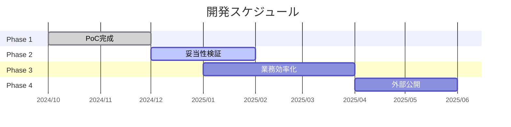

# プロジェクト概要

特許侵害調査を自動化するシステム **IP Rich Tools** のドキュメントサイトです。

## システム概要

IP Rich Toolsは、特許侵害調査プロセスを自動化し、効率化するためのシステムです。

## 開発タイムライン

| Phase | 内容 | 期間 | 体制 |
|-------|------|------|------|
| Phase 1 | PoC完成 | 2024/10〜12 | エンジニア 0.1 |
| Phase 2 | 妥当性検証 | 2024/12〜2025/02 | Eng 0.1 + 特許 0.2 |
| Phase 3 | 業務効率化 | 2025/01〜04 | ⚠️ 体制構築が必要 |
| Phase 4 | 外部公開 | 2025/04〜 | ⚠️ 体制構築が必要 |

## 業務フローと自動化対象

### 自動化対象

| 対象 | 内容 | 実装状況 |
|-----|------|---------|
| **① 特許一覧作成** | J-PlatPat連携による特許情報の自動取得 | Phase 3 で対応予定 |
| **② 侵害調査** | OpenAI Deep Researchによる侵害可能性分析 | Phase 1-2 で対応中 |
| **③ 売上推定** | 被疑侵害製品の売上・収益性分析 | Phase 3 で対応予定 |

### 人で対応する業務

- 無効調査（特許の有効性確認）
- 訴訟手続き（法的対応）
- 総合判断（訴訟可否の最終決定）

## Phase別 機能要件

| 機能 | Phase 1 PoC完成 | Phase 2 妥当性検証 | Phase 3 業務効率化 | Phase 4 外部公開 |
|-----|:---:|:---:|:---:|:---:|
| 侵害調査（Deep Research） | ✅ | − | − | − |
| 夜間バッチ実行 | ✅ | − | − | − |
| 侵害調査履歴の閲覧 | ✅ | − | − | − |
| J-PlatPat連携 | − | − | ✅ | − |
| 侵害調査結果の管理・検索 | − | − | ✅ | − |
| 侵害額推定 | − | − | ✅ | − |
| CSV出力 | − | − | ✅ | − |
| ログイン機能 | − | − | − | ✅ |
| ユーザー・グループ管理 | − | − | − | ✅ |
| 利用料管理・課金 | − | − | − | ✅ |

※ Phase 3では侵害結果を検索し、気になるもののみ侵害額推定を実行するフローを想定

## Phase 詳細

### ✅ Phase 1 完了: PoC完成

:::tip 達成
特許侵害調査の自動化基盤を構築し、動作確認完了
:::

**できること**
- 特許番号と請求項1を入力するだけで侵害製品調査を開始できる
- バッチ処理により夜間や休日も自動で調査を実行可能
- 調査結果をデータベースに保存し、いつでも参照可能
- 過去の調査履歴を一覧で確認・再利用できる

### 🚧 Phase 2 進行中: 業務利用可能性検証

:::info 目標
iprich内で業務利用可能性を検証できる状態にする
:::

**達成するとできること**
- 複数の特許を一括登録し、自動的に順次調査を実行
- 発見した侵害製品の売上規模を自動推定
- 損害賠償額の概算を自動計算

### 📋 Phase 3: 業務運用の効率化

:::info 目標
iprich社内で日常業務として利用可能な状態にする
:::

**達成するとできること**
- J-PlatPatから特許情報を自動取得（手入力不要）
- 侵害調査結果を管理し、条件検索で絞り込み
- 気になる結果のみ侵害額推定を実行
- 調査結果をCSVでエクスポート

:::warning 体制構築が必要
Phase 3以降は機能開発のボリュームが増加するため、エンジニアリソースの増強を検討
:::

### 🌐 Phase 4: 外部公開（商用利用）

:::info 目標
外部顧客へのサービス提供と収益化
:::

**達成するとできること**
- 外部の企業・特許事務所にサービスとして提供
- ユーザーごとにログインし、自社データのみ閲覧
- ユーザーグループ（企業）単位で利用料を管理・請求

:::warning 体制構築が必要
商用サービスとして運用するため、開発・運用体制の本格的な構築が必要
:::

## システムの使い方

### Step 1: 特許情報の入力

- **特許番号**を入力（例: 07666636, US7666636）
- **請求項1の全文**を入力
- この2つだけで分析開始！

### Step 2: AI による自動調査（バックグラウンド実行）

- OpenAI Deep ResearchがWeb検索で情報収集
- 日本国内でサービス展開している外国企業の製品を調査
- 請求項1の構成要件を満たす製品を検出

### Step 3: 結果の確認

- 各製品の構成要件充足性をテーブルで表示
- 充足判断（○/×）と根拠となるURL・公開情報を提示
- 複数製品の分析結果を一覧で確認可能

## 関連リンク

- [Phase 1 アプリケーション](https://ip-rich-poc-phase1.vercel.app)
