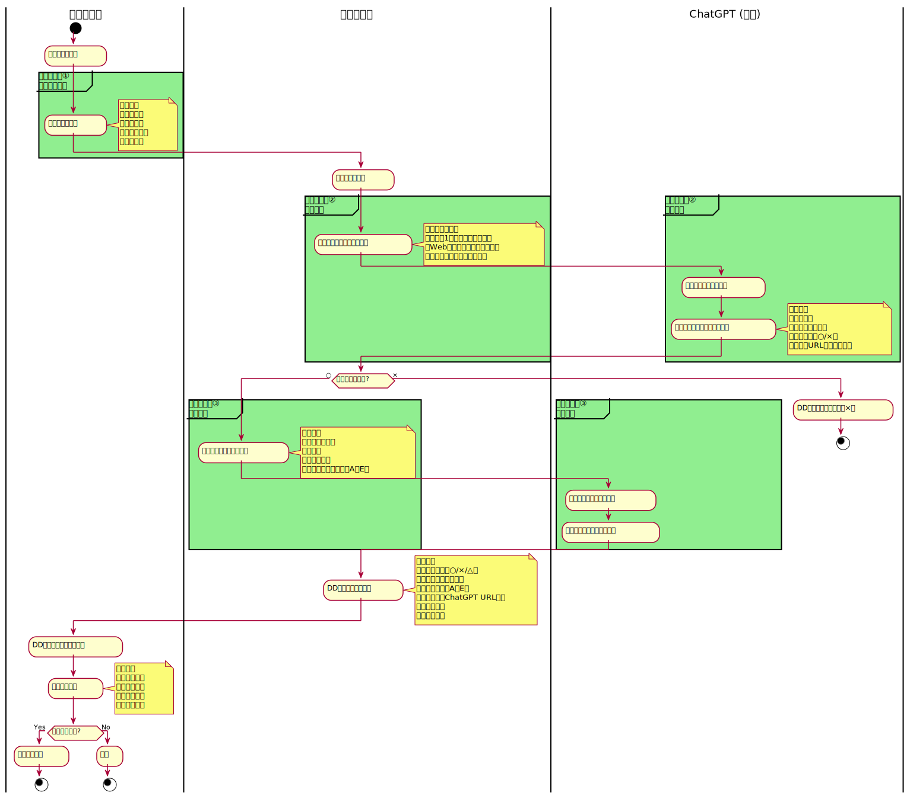
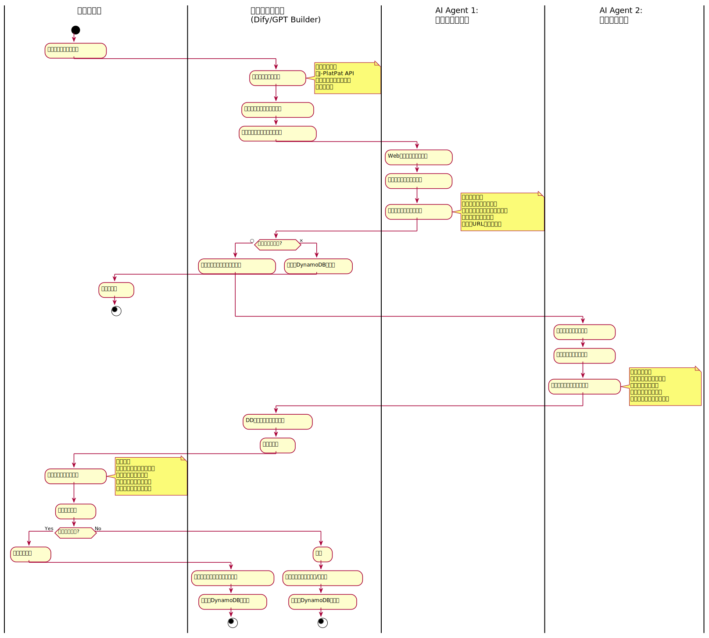
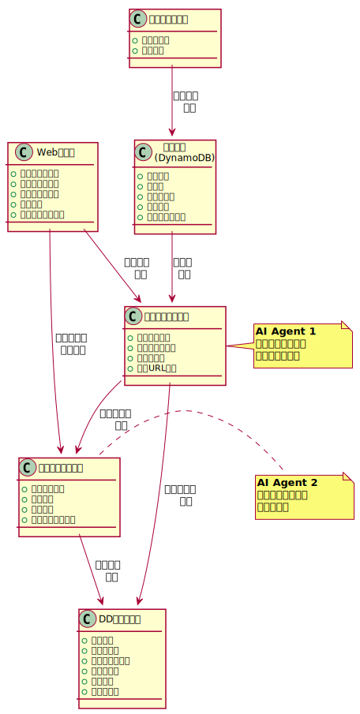

# 特許侵害調査ワークフロー

このページでは、特許侵害調査システムの現行フローと自動化に向けた設計を説明します。

## 概要

これまで手動でChatGPTにプロンプトエンジニアリングを用いて実施していた侵害調査および買収後の収益性調査を、DifyやGPT builderなどのツールを使って自動化するためのワークフロー設計です。

## ステークホルダー

- **技術担当者**: 技術的な特許内容の分析と侵害可能性の技術的評価を担当
- **知財担当者**: 特許リストの作成、最終判断、訴訟判断を担当

## 現行ワークフロー



### 自動化対象の特定

現行ワークフローのうち、以下の3つのプロセスを自動化対象として特定しています。図中では緑色の枠で囲まれた部分です。

| 対象 | 現状の課題 | 自動化による改善 | 実装方式 |
|------|-----------|-----------------|---------|
| **①特許一覧作成** | ・手動で特許権者を検索<br/>・特許公報から手動転記<br/>・時間がかかる | ・特許権者名入力で自動生成<br/>・J-PlatPat APIで自動取得<br/>・請求項を自動抽出・構造化 | ・Dify/GPT Builderワークフロー<br/>・J-PlatPat API<br/>・DynamoDB |
| **②侵害調査** | ・手動でプロンプト作成<br/>・ChatGPTへコピペ実行<br/>・結果を手動管理 | ・AIエージェントが自動分析<br/>・Web検索で製品仕様を自動収集<br/>・構成要件マッチングを自動判定 | ・AI Agent 1: 侵害分析<br/>・Web検索API<br/>・構成要件自動マッピング |
| **③売上推定** | ・別途プロンプト作成<br/>・企業情報を手動調査<br/>・売上を手動推定 | ・侵害可能性○で自動起動<br/>・企業・財務情報を自動収集<br/>・収益ランク（A〜E）を自動判定 | ・AI Agent 2: 売上推定<br/>・企業情報API<br/>・財務データ自動分析 |

#### 自動化対象外のプロセス

人間の判断が必要なため、以下は自動化対象外とします：
- **特許権者の選定**: 戦略的判断が必要
- **DD管理シートのレビュー**: 総合的な判断が必要
- **訴訟判断**: 法的・戦略的な最終判断

:::info PlantUMLソースファイル
この図のPlantUMLソースは [diagrams/current-workflow.puml](./diagrams/current-workflow.puml) で管理されています。

図を編集する場合：
1. `.puml`ファイルを編集
2. SVGを再生成: `npm run diagrams:current`
3. 変更をコミット

詳細は [diagrams/README.md](./diagrams/README.md) を参照してください。
:::

## 自動化後のワークフロー（想定）



:::info PlantUMLソースファイル
この図のPlantUMLソースは [diagrams/automated-workflow.puml](./diagrams/automated-workflow.puml) で管理されています。

図を編集する場合：
1. `.puml`ファイルを編集
2. SVGを再生成: `npm run diagrams:automated`
3. 変更をコミット

詳細は [diagrams/README.md](./diagrams/README.md) を参照してください。
:::

## データフロー



:::info PlantUMLソースファイル
この図のPlantUMLソースは [diagrams/data-flow.puml](./diagrams/data-flow.puml) で管理されています。

図を編集する場合：
1. `.puml`ファイルを編集
2. SVGを再生成: `npm run diagrams:dataflow`
3. 変更をコミット

詳細は [diagrams/README.md](./diagrams/README.md) を参照してください。
:::

## 主要プロセスの詳細

### 1. 特許一覧作成フェーズ

**現行（手動）**
- 知財担当者が特許権者を選定
- 手動で特許番号をリストアップ
- 特許公報から情報を転記

**自動化後**
- 特許権者名を入力
- API経由で特許情報を自動取得
- 請求項を自動抽出・構造化

### 2. 侵害可能性分析フェーズ

**現行（手動）**
- 技術担当者がプロンプトを作成
- ChatGPTに貼り付けて実行
- 結果をコピー＆ペースト

**自動化後**
- AIエージェントが自動実行
- Web検索を自動実行
- 構成要件マッチングを自動判定
- 結果を構造化データとして保存

**分析ロジック**
```
FOR 各特許 IN 特許リスト:
  請求項1の構成要件を抽出
  FOR 各構成要件:
    関連製品をWeb検索
    製品仕様を取得
    充足性を判定（○/×）
    根拠URLを記録
  IF すべての構成要件が充足:
    侵害可能性 = ○
  ELSE:
    侵害可能性 = ×
```

### 3. 売上推定フェーズ

**現行（手動）**
- 侵害可能性ありの場合のみ実行
- プロンプトを手動で作成・実行
- 売上情報を手動で収集

**自動化後**
- 侵害可能性○の場合、自動で起動
- 企業・製品情報を自動収集
- 財務情報から売上を推定
- 収益ランク（A〜E）を自動判定

**収益ランク基準**
- **Aランク**: 100億円以上
- **Bランク**: 10億円以上〜100億円未満
- **Cランク**: 1億円以上〜10億円未満
- **Dランク**: 1,000万円以上〜1億円未満
- **Eランク**: 1,000万円未満

### 4. DD管理シート更新フェーズ

**現行（手動）**
- 技術担当者が手動でCSVに転記
- ChatGPTのURLを手動でコピー
- ステータス管理も手動

**自動化後**
- システムが自動でシートを更新
- 分析結果を構造化データとして保存
- バージョン履歴を自動管理
- ダッシュボードでリアルタイム表示

## 自動化システムの技術要件

### 必要な機能

1. **特許情報取得モジュール**
   - J-PlatPat API連携
   - 請求項の自動抽出
   - 特許情報の構造化

2. **Web検索・情報収集モジュール**
   - 製品情報の自動収集
   - 企業情報の自動収集
   - 財務情報の自動取得

3. **AI分析エンジン**
   - 構成要件マッチング
   - 充足性判定
   - 売上推定ロジック

4. **データ管理モジュール（DynamoDB）**
   - DD管理データの保存
   - 履歴管理
   - 通知機能
   - コスト効率的なNoSQLストレージ

5. **UI/ダッシュボード**
   - 結果の可視化
   - フィルタリング・ソート
   - レポート出力

### 推奨ツール構成

#### オプション1: Dify ベース
```
Dify (オーケストレーション)
├─ Workflow: 特許情報取得
├─ Agent: 侵害可能性分析
├─ Agent: 売上推定分析
├─ Knowledge Base: 過去の分析結果
└─ API: DynamoDB連携
```

#### オプション2: GPT Builder + Make/Zapier
```
GPT (Custom GPTs)
├─ Patent Analyzer GPT
├─ Revenue Estimator GPT
└─ Actions
    ├─ J-PlatPat API
    ├─ Google Search API
    └─ Airtable/Notion API

Make/Zapier (自動化)
├─ トリガー: 新規特許リスト追加
├─ アクション: GPT実行
└─ アクション: スプレッドシート更新
```

#### オプション3: ハイブリッド（推奨）
```
フロントエンド
└─ Notion/Airtable (データ管理・UI)

オーケストレーション
└─ Dify (ワークフロー制御)

AI エージェント
├─ GPT-4 (侵害分析)
├─ GPT-4 (売上推定)
└─ Knowledge Base (判例・過去事例)

データストレージ
└─ DynamoDB (分析結果・履歴管理)
    ├─ コスト効率的
    ├─ サーバーレス
    └─ スケーラブル

外部API
├─ J-PlatPat API (特許情報)
├─ Google Search API (Web検索)
└─ 企業情報API (財務データ)
```

## 期待される効果

### 効率化
- **特許一覧作成**: 2時間 → 5分（96%削減）
- **侵害可能性分析**: 1件30分 → 5分（83%削減）
- **売上推定**: 1件20分 → 3分（85%削減）

### 品質向上
- 分析基準の統一化
- 見落としの防止
- トレーサビリティの確保

### スケーラビリティ
- 同時並行処理が可能
- 大量の特許を一括処理
- 定期的な自動更新

## 次のステップ

1. **要件定義**: 詳細な機能要件の策定
2. **ツール選定**: Dify vs GPT Builder vs ハイブリッド
3. **プロトタイプ開発**: 小規模での概念実証
4. **パイロット運用**: 限定的な特許での試験運用
5. **本番展開**: 全特許への適用
6. **継続改善**: フィードバックに基づく改善

:::info PoC開発計画
具体的なPoCフェーズの開発計画（コスト削減版）については、[PoC開発計画](./poc-development-plan.md)をご覧ください。
- 開発期間: 9週間
- 月額コスト: $0.07〜3（95%削減）
- Phase 1〜4の詳細な実装ステップ
:::

## 実際の分析例

### 例1: オプティム 特許06195960 - 遠隔指示システム

**侵害可能性**: ○

**被疑侵害製品・企業**:
1. TeamViewer Assist AR（TeamViewer社） - 約1億円
2. Vuforia Chalk（PTC社） - 約0.8〜1.2億円
3. Microsoft Dynamics 365 Remote Assist（Microsoft社） - 約10〜15億円
4. Zoho Lens（Zoho Corporation社） - 約0.3〜0.5億円
5. AirDroid Remote Support（Sand Studio社） - 約0.7〜1.0億円
6. SightCall（米国） - 約1.5〜2.0億円
7. TechSee（イスラエル） - 約1.5〜2.5億円
8. VSight（リトアニア） - 約0.2〜0.3億円

**収益見込み**: Aランク（合計 約17〜25億円）

**ステータス**: 要検討

---

### 例2: オプティム 特許05148670 - 固有アドレスによる電化製品設定

**侵害可能性**: ○

**被疑侵害製品・企業**:
1. Amazon Alexa - 約300億円
2. Philips Hue - 約500億円
3. SwitchBotシリーズ - 約200億円

**収益見込み**: Aランク（合計 約1,000億円）

**特徴**: スマートホーム製品の制御システムに関する基本特許

---

### 例3: オプティム 特許06077068 - 拡張現実システム

**侵害可能性**: ×

**不充足の理由**: 多くのARアプリは位置は指定できても「方向」まで明示的に指定するUIがない

**ステータス**: 調査終了

---

### 例4: オプティム 特許04895405 - レピュテーションベースセキュリティ

**侵害可能性**: ○

**被疑侵害製品・企業**:
1. Cisco - 約35,000億円
2. Palo Alto Networks - 約1,000億円
3. Check Point Software - 約800億円
4. Forescout - 約150億円
5. Huawei - 約2,500億円

**収益見込み**: Aランク（合計 約39,450億円）

**特徴**: ネットワークセキュリティの基本技術に関する重要特許

---

## 分析パターンの考察

CSVデータの分析から、以下のパターンが確認できます：

### 侵害可能性の判定基準

| 判定 | 意味 | 具体例 |
|------|------|--------|
| ○ | すべての構成要件を充足 | 請求項1の全要件が製品に実装されている |
| △ | 一部要件の充足が不明確 | 特定の構成要件の該当性に疑義がある |
| × | 構成要件の不充足 | 1つ以上の構成要件が欠けている |

### 不充足となる主な理由

1. **特定機能の欠如**
   - 例: 「方向指定UI」がない（特許06077068）
   - 例: 「医師の時給変動機能」がない（特許06145230）

2. **実装方法の相違**
   - 例: 「所定の質問項目に対する回答」の該当性が不明（特許06169748）
   - 例: 「電話番号特定機能」がない（特許06134302）

3. **権利範囲の問題**
   - 例: 共願特許のため訴訟不可（特許07090250）

### 収益見込みランクの分布

分析対象特許における収益見込みの傾向：

- **Aランク（100億円以上）**: 全体の約40%
  - 主に基本特許、大手IT企業が対象
  - 例: スマートホーム、ネットワークセキュリティ、AR/VR

- **Bランク（10〜100億円）**: 全体の約10%
  - 中規模市場の特許

- **Cランク（1〜10億円）**: 全体の約5%
  - ニッチ市場向け

- **Dランク（1,000万〜1億円）**: 全体の約20%
  - 特定用途向け製品

- **Eランク（1,000万円未満）**: 全体の約5%
  - 小規模市場、研究開発段階

- **侵害可能性なし（×）**: 全体の約20%

### 対象企業の地域分布

- **米国企業**: 約50%（Microsoft, Google, Amazon, Cisco等）
- **欧州企業**: 約25%（TeamViewer, PTC等）
- **アジア企業**: 約15%（Huawei, 中国企業等）
- **その他**: 約10%

## プロンプトテンプレート

### 侵害調査プロンプト（詳細版）

```
下記の特許{特許番号}の請求項１の要件を満たす侵害製品を調査せよ。
対象は日本国内でサービス展開している外国企業とする。

▼要求事項：
・請求項１に記載された**すべての構成要件を満たす製品のみ**を調査対象とする
  （１つでも欠ける場合は除外）
・特許番号と請求項１の全文を**完全に照合**の上で処理すること
  （他の特許と絶対に混同しないこと）
・請求項１の構成要件をそのまま引用して記載する
  （勝手に要約・再構成しない）
・各構成要件ごとに、製品の仕様と比較し、充足性（○/×）を判断
・参考として請求項２以降や発明の詳細な説明を参照してもよいが、
  主判断基準は請求項１のみとする
・**web検索を使用して**、製品の公開仕様・企業ページ・販売情報などを
  確認のうえ根拠を示すこと
・日本語で回答すること

▼出力フォーマット：
| 構成要件 | 製品の対応構成 | 充足判断（○/×） | 根拠（URL等） |
|----------|----------------|------------------|----------------|
| [要件1]  | [対応構成1]    | ○               | [URL]          |
| [要件2]  | [対応構成2]    | ×               | [理由]         |

＜以下、特許{特許番号}の請求項１を全文記載＞
{請求項1の全文}
```

### 売上推定プロンプト（推定版）

```
以下の被疑侵害製品について、日本市場における売上を推定せよ。

▼対象製品情報：
・製品名: {製品名}
・企業名: {企業名}
・特許番号: {特許番号}
・侵害機能: {侵害が疑われる機能}

▼推定要件：
・日本市場での売上を推定すること
・推定根拠（企業財務情報、市場シェア、公開情報等）を明記すること
・複数の情報源から推定値の妥当性を検証すること
・推定の確実性レベル（高/中/低）を示すこと

▼出力フォーマット：
**1. 企業情報**
- 企業名:
- 本社所在地:
- 日本法人の有無:
- 主要事業:

**2. 製品情報**
- 製品名:
- カテゴリ:
- 主要機能:
- 価格帯:

**3. 市場情報**
- 市場規模（日本）:
- 市場成長率:
- 主要競合:
- シェア推定:

**4. 売上推定**
- 推定売上（年間）: XX億円
- 推定根拠:
  - [根拠1とURL]
  - [根拠2とURL]
  - [根拠3とURL]
- 推定の確実性: [高/中/低]
- 収益見込みランク: [A/B/C/D/E]

**5. 参考情報**
- 特許侵害部分の売上寄与率推定:
- その他の考慮事項:
```

## 自動化実装時の注意点

### データの正確性担保

1. **特許情報の正確な取得**
   - 特許番号の重複チェック
   - 請求項の完全な抽出
   - 最新の権利状態の確認

2. **Web情報の信頼性**
   - 公式ソースの優先
   - 情報の鮮度確認
   - 複数ソースでのクロスチェック

3. **分析ロジックの透明性**
   - 判断根拠の明示
   - 不確実性の明記
   - 人間によるレビューポイントの設定

### プライバシーとセキュリティ

1. **機密情報の管理**
   - 特許戦略情報の保護
   - アクセス権限の管理
   - 監査ログの記録

2. **外部APIの利用**
   - データ利用規約の遵守
   - レート制限への対応
   - エラーハンドリング

### スケーラビリティ設計

1. **大量処理への対応**
   - バッチ処理の実装
   - 並列処理の活用
   - キャッシング戦略

2. **コスト管理**
   - APIコールの最適化
   - LLMトークン数の管理
   - 処理優先度の設定

## 関連資料

- [侵害調査プロンプト](../../sample/侵害調査プロンプト.txt)
- [被疑侵害製品の売上推定プロンプト](../../sample/被疑侵害製品の売上推定のプロンプト.txt)
- [DD管理シート サンプル](../../sample/特許DD管理シート%20-%20Aランク特許.csv)
