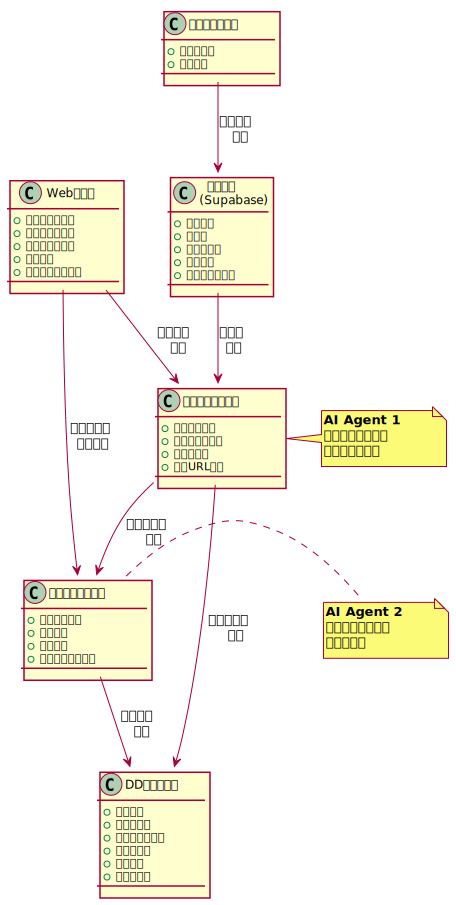

# ワークフロー全体概要

特許侵害調査システムの現行フローと自動化に向けた設計を説明します。

## 概要

これまで手動でChatGPTにプロンプトエンジニアリングを用いて実施していた侵害調査および買収後の収益性調査を、OpenAI Deep Research API + Next.jsで自動化するためのワークフロー設計です。

## ステークホルダー

- **技術担当者**: 技術的な特許内容の分析と侵害可能性の技術的評価を担当
- **知財担当者**: 特許リストの作成、最終判断、訴訟判断を担当

## 現行ワークフロー

### 自動化対象の特定

現行ワークフローのうち、以下の3つのプロセスを自動化対象として特定しています。

| 対象 | 現状の課題 | 自動化による改善 | 実装状況 |
|-----|----------|----------------|---------|
| **①特許一覧作成** | 手動で特許権者を検索、特許公報から手動転記 | J-PlatPat APIで自動取得、請求項を自動抽出 | Phase 3 で実装予定 |
| **②侵害調査** | 手動でプロンプト作成、ChatGPTへコピペ実行 | AIエージェントが自動分析、Web検索で製品仕様を自動収集 | Phase 1 で実装済み |
| **③売上推定** | 別途プロンプト作成、企業情報を手動調査 | 侵害可能性○で自動起動、収益ランクを自動判定 | Phase 3 で実装予定 |

### 自動化対象外のプロセス

人間の判断が必要なため、以下は自動化対象外とします：

- **特許権者の選定**: 戦略的判断が必要
- **DD管理シートのレビュー**: 総合的な判断が必要
- **訴訟判断**: 法的・戦略的な最終判断

## 自動化後のワークフロー（想定）

## データフロー

## 期待される効果

### 効率化

| 作業 | 現行 | 自動化後 | 削減率 |
|-----|-----|---------|-------|
| 特許一覧作成 | 2時間 | 5分 | 96% |
| 侵害可能性分析 | 30分/件 | 5分/件 | 83% |
| 売上推定 | 20分/件 | 3分/件 | 85% |

### 品質向上

- 分析基準の統一化
- 見落としの防止
- トレーサビリティの確保

### スケーラビリティ

- 同時並行処理が可能
- 大量の特許を一括処理
- 定期的な自動更新
